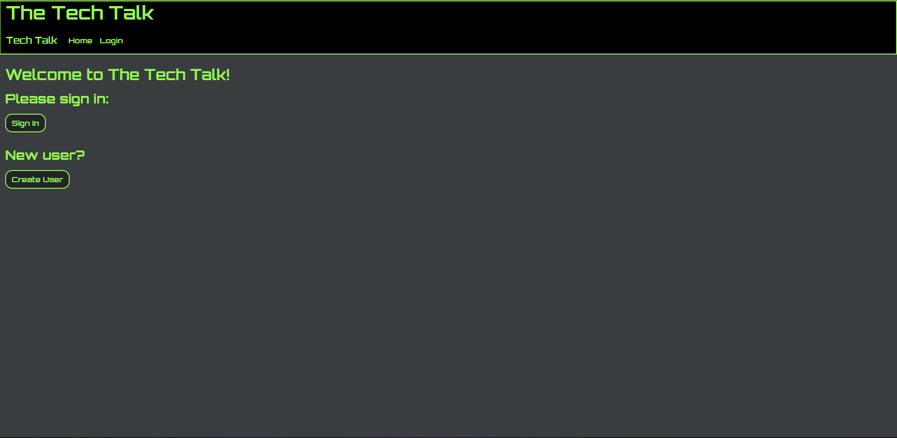

# BloggersBlog
A CMS-styled blog site featuring a hub for techies to post comments for discussion.

## Link to Application 

_https://bloggers-blog123.herokuapp.com/_
## Project Description

The purpose of this project is to build a blog-site web application that uses both front and back-end logic, ORM, databasing, and front-end development. This application is truly a full-stack application as it incorporates client side interaction to perform http requests such that data is retrieved/written into a database. MVC (Model-View-Controller) is the paradigm that was used to make this project as evident in the file structure.

## What to Expect From the Application

The user will be able to access a live application deployed through Heroku which presents the user a blog site. User sign-up and and login is required to both create and view posts. _**THIS IS A BEGINNER APP IN PROGRESS, PLEASE DON'T INPUT PERSONAL INFORMATION!**_ 

Once a user is created, they will be taken to a posts page where all existing posts will appear. To make a post, the user can click the "New Post" button and input a title and comment for submission. Other users are allowed to comment onto the post.

_In the app's current state, comments can be submitted but won't be shown. This will be updated in a future release._

## Technologies/Methodology

* Javascript
* Node.js
* MySql Workbench
* SQL
* MVC (Model-View-Controller)
* OOP
* Express
* Sequelize
* Handlebars
# Installation Instructions

When cloning or forking this application, please pay attention to the .env.example file. This application uses the dotenv package so that private information can be stored since a password is required to connect to the MySQL server.

Use the following command to copy the env example file so you can replace the variable assignment in your .env file:

`cp .env.example .env`

 Ensure to run the queries in db/schema.sql to create the database required for this project.

## Screenshots

